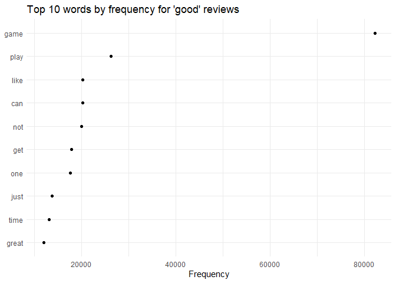
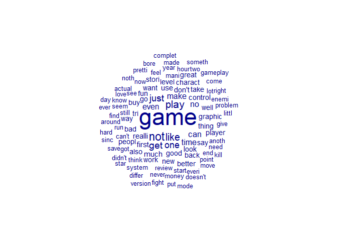
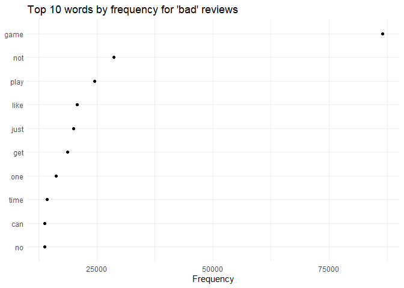

## Data loading and processing

Load the dataset

    reviews <- read.csv("https://drive.google.com/uc?id=1BAsGEwOxWCz0OJQZ6Z5UE_IxrLr2xKvm&export=download&confirm=t&uuid=1ebf996a-18b1-4866-ae3f-1ccee0a120d1", sep=";")
    reviews <- reviews %>% select(reviewText, overall,summary)
    reviews$ID <- 1:nrow(reviews)
    summary(reviews)

    ##   reviewText           overall        summary                ID        
    ##  Length:231780      Min.   :1.000   Length:231780      Min.   :     1  
    ##  Class :character   1st Qu.:4.000   Class :character   1st Qu.: 57946  
    ##  Mode  :character   Median :5.000   Mode  :character   Median :115891  
    ##                     Mean   :4.086                      Mean   :115891  
    ##                     3rd Qu.:5.000                      3rd Qu.:173835  
    ##                     Max.   :5.000                      Max.   :231780

Create column where overall 5 & 4 = ‘good’, overall 3 = ‘med’ and
overall 2 & 1 = ‘bad’

    reviews <- subset(reviews, overall != 3)
    reviews <- reviews %>% mutate(sentiment =
                         case_when(overall <= 2 ~ "bad", 
                                   overall >= 4 ~ "good")
    )

    sentimentable <- table(reviews$sentiment)
    labels <- paste(names(sentimentable), "\n", sentimentable, sep="")
    pie(sentimentable, labels = labels,
       main="Pie Chart of sentimenting distribution")

We can observe that there are far more good reviews than bad. We will
randomly sample 20000 of each category for further analysis and
modelling

    goodsample <- reviews[ sample(which ( reviews$sentiment == "good" ) ,20000), ]
    badsample <- reviews[ sample(which ( reviews$sentiment == "bad" ) ,20000), ]
    reviews <- rbind(goodsample,badsample)
    summary(reviews)

    ##   reviewText           overall        summary                ID        
    ##  Length:40000       Min.   :1.000   Length:40000       Min.   :     1  
    ##  Class :character   1st Qu.:1.000   Class :character   1st Qu.: 60390  
    ##  Mode  :character   Median :3.000   Mode  :character   Median :116548  
    ##                     Mean   :3.081                      Mean   :117046  
    ##                     3rd Qu.:5.000                      3rd Qu.:173822  
    ##                     Max.   :5.000                      Max.   :231777  
    ##   sentiment        
    ##  Length:40000      
    ##  Class :character  
    ##  Mode  :character  
    ##                    
    ##                    
    ## 

## Processing text and creating corpus

Create corpus and remove stopwords, only keeping some important ones
that can indicate sentiment

    custom_english <- stopwords("english")[! stopwords("english") %in% c("isn't",      "aren't",     "wasn't" ,    "weren't"  ,  "hasn't"  ,   "haven't"  ,  "hadn't"  ,   "doesn't",    "don't" ,     "didn't","won't","wouldn't","shan't","shouldn't","can't","cannot","couldn't",   "mustn't","no","nor","not")]
    corp <- corpus(reviews, text_field = 'reviewText')
    dtm <- corp |>
      tokens(remove_punct = T, remove_numbers = T, remove_symbols = T) |>   
      tokens_tolower() |>                                                    
      tokens_remove(custom_english) |>                                     
      tokens_wordstem() |>
      dfm()

Word cloud for ‘good’ reviews

    textplot_wordcloud(dfm_subset(dtm, sentiment == "good"),max_words=100,rotation=0,min_size=1) 

    tstat_freq <- textstat_frequency(dfm_subset(dtm, sentiment == "good"), n =10)
    ggp <- ggplot(tstat_freq, aes(reorder(feature,frequency), frequency)) +   
      geom_point() +
      coord_flip() +
      labs(x = NULL, y = "Frequency") +
      theme_minimal() + ggtitle("Top 10 words by frequency for 'good' reviews")
    ggp

Word cloud for ‘bad’ reviews

    textplot_wordcloud(dfm_subset(dtm, sentiment == "bad"),max_words=100,rotation=0,min_size=1) 

    tstat_freq <- textstat_frequency(dfm_subset(dtm, sentiment == "bad"), n =10)
    ggp <- ggplot(tstat_freq, aes(reorder(feature,frequency), frequency)) +   
      geom_point() +
      coord_flip() +
      labs(x = NULL, y = "Frequency") +
      theme_minimal()+ ggtitle("Top 10 words by frequency for 'bad' reviews")
    ggp

## Building the model and testing

Get the training and testing sets (80% for training 20% for testing)

    set.seed(300)
    id_train <- createDataPartition(docvars(dtm)$sentiment, p = .8, 
                                      list = FALSE, 
                                      times = 1)

    # get training set
    dfmat_test <- dfm_subset(dtm, docvars(dtm)$ID %in% id_train)

    # get test set (documents not in id_train)
    dfmat_training <- dfm_subset(dtm, !docvars(dtm)$ID %in% id_train)

We’ll be using the naive bayes model to classify the documents. From the
training summary we can see some feature scores and notice that positive
words like ‘love’ have a higher score for ‘good’ and negative words like
‘hate’ have higher score for ‘bad’.

    tmod_nb <- textmodel_nb(dfmat_training, docvars(dfmat_training)$sentiment)
    summary(tmod_nb)

    ## 
    ## Call:
    ## textmodel_nb.dfm(x = dfmat_training, y = docvars(dfmat_training)$sentiment)
    ## 
    ## Class Priors:
    ## (showing first 2 elements)
    ##  bad good 
    ##  0.5  0.5 
    ## 
    ## Estimated Feature Scores:
    ##         first      say     like    game     much      read   review      site
    ## bad  0.003366 0.002345 0.009112 0.03745 0.003691 0.0008723 0.002110 1.624e-04
    ## good 0.003523 0.002236 0.009226 0.03636 0.003985 0.0006197 0.001496 9.329e-05
    ##           said      bore     last  mission      not      true      alot
    ## bad  0.0008390 0.0015295 0.001142 0.001170 0.012727 0.0003318 0.0001888
    ## good 0.0007707 0.0004039 0.001096 0.001517 0.009201 0.0004331 0.0003032
    ##          excit    right      get       go   though     even intense.th  graphic
    ## bad  0.0004774 0.001787 0.008139 0.004192 0.001140 0.005017  4.967e-07 0.003053
    ## good 0.0003605 0.001494 0.008002 0.003512 0.001709 0.003321  2.120e-06 0.003050
    ##          best      seen       fps     light    detail      amaz  charact
    ## bad  0.001081 0.0005275 0.0003249 0.0004342 0.0003338 0.0003919 0.002955
    ## good 0.002495 0.0005513 0.0004172 0.0005831 0.0006557 0.0011254 0.003783

Now we test our model. We can see that the accuracy we got was 82% which
is acceptable for a model of this size. Its important to note that Naive
Bayes assumes predictors as being totally independent from each other,
and that never happens in language. However due to its speed, this
algorithm is still widely used for spam detection and sentiment
analysis.

    dfmat_matched <- dfm_match(dfmat_test, features = featnames(dfmat_training))
    actual_class <- docvars(dfmat_matched)$sentiment
    predicted_class <- predict(tmod_nb, newdata = dfmat_matched)
    tab_class <- table(actual_class, predicted_class)
    confusionMatrix(tab_class, mode = "everything",positive = 'good')

    ## Confusion Matrix and Statistics
    ## 
    ##             predicted_class
    ## actual_class  bad good
    ##         bad  1978  466
    ##         good  409 2399
    ##                                          
    ##                Accuracy : 0.8334         
    ##                  95% CI : (0.823, 0.8434)
    ##     No Information Rate : 0.5455         
    ##     P-Value [Acc > NIR] : < 2e-16        
    ##                                          
    ##                   Kappa : 0.6647         
    ##                                          
    ##  Mcnemar's Test P-Value : 0.05834        
    ##                                          
    ##             Sensitivity : 0.8373         
    ##             Specificity : 0.8287         
    ##          Pos Pred Value : 0.8543         
    ##          Neg Pred Value : 0.8093         
    ##               Precision : 0.8543         
    ##                  Recall : 0.8373         
    ##                      F1 : 0.8458         
    ##              Prevalence : 0.5455         
    ##          Detection Rate : 0.4568         
    ##    Detection Prevalence : 0.5347         
    ##       Balanced Accuracy : 0.8330         
    ##                                          
    ##        'Positive' Class : good           
    ## 

    confusionMatrix

    ## function (data, ...) 
    ## {
    ##     UseMethod("confusionMatrix")
    ## }
    ## <bytecode: 0x00000199cca38780>
    ## <environment: namespace:caret>
